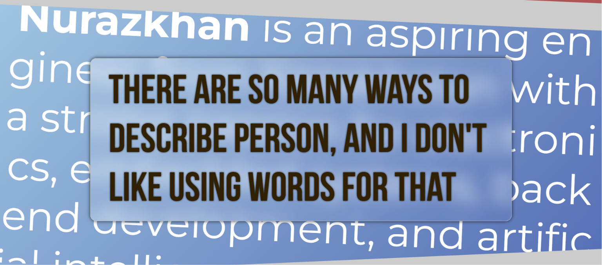

#Personal Html

well I did this for StarDance hack club. 
but I know it doesn't bother you.
So, let me tell what I did.

I did personal html file pure html and css. Just vibing and having fun with css styles.

In general it consists of 5 sections. And each of them are in different style and connected by me.

I gave a lot of attention to the typography.
Fonts I used
- Montserrat
- Poppins
- Courier New
- Bebase Neue
- Coral Pixels
- Jacquard 24
- rubik Pixels

